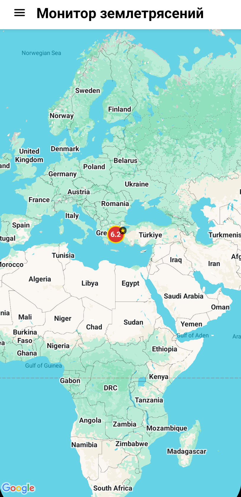
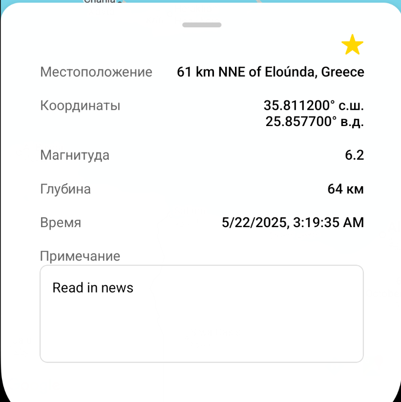
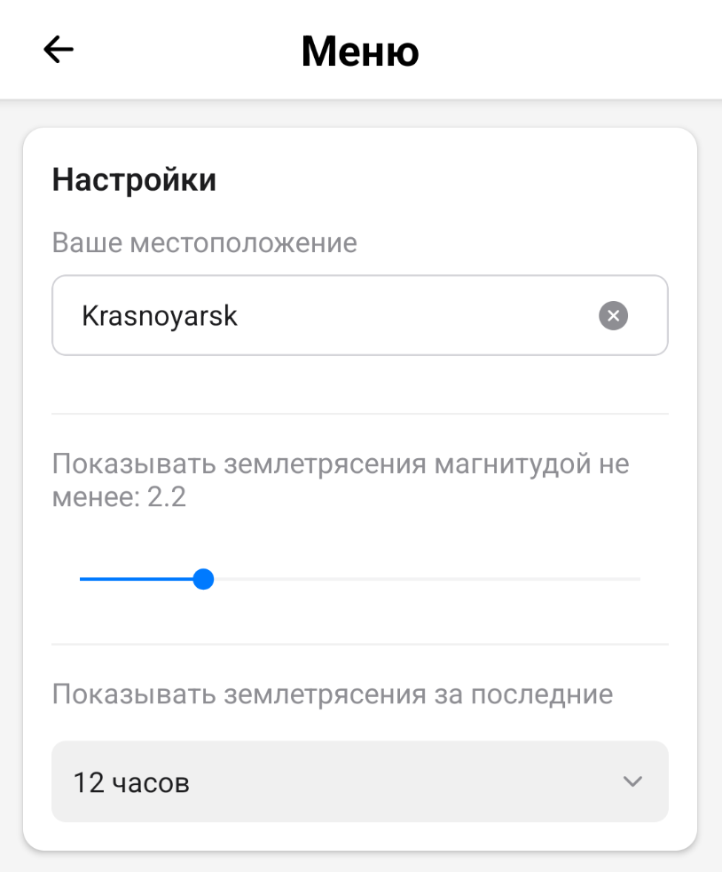

# Earthquake Monitor

## How to build apk

1. Install Node.js and npm.

2. Install dependencies

   ```bash
   npm install
   ```

3. Install EAS CLI.

   ```bash
    npm install -g eas-cli
   ```

4. Sign up to [expo.dev](https://expo.dev) and login via CLI.

   ```bash
    eas login
   ```

5. Run a build.

   ```bash
    eas build -p android --profile preview
   ```

## How to use

The application has two screens: a map and settings, which are navigated by the upper left button.

### Map screen



On the map screen, you can navigate the earth's surface, see earthquake markers that match the filters, and click on the markers to get complete information.



In the earthquake information, you can find out its main parameters, add it to your favorites and leave a note for yourself.

### Settings screen



On the settings screen, you can save your location (when opening the app, the map will open at this location), as well as select the minimum magnitude of the displayed earthquakes and the time period for which they are collected.
